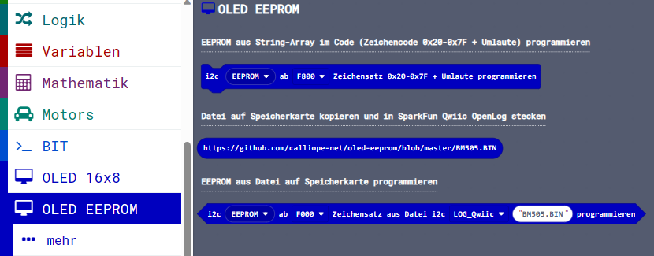

> Diese Seite bei [https://calliope-net.github.io/oled-eeprom/](https://calliope-net.github.io/oled-eeprom/) öffnen.

##### OLED neu gedacht - 2 Displays gleichzeitig (2x16x8=265 Zeichen) - EEPROM - 1 Stecker - i2c-Bus
##### Querformat 16x8 - Hochformat 8x16 - mehrere Zeichensätze je 256 Zeichen - Bilder im EEPROM

### Calliope Erweiterung 'EEPROM Programmierung Zeichensatz für OLED Displays':

* [SparkFun Qwiic EEPROM Breakout - 512Kbit](https://www.sparkfun.com/products/18355)

* [SparkFun Qwiic OpenLog](https://www.sparkfun.com/products/15164)

Dieses Repository kann als **Erweiterung** in MakeCode hinzugefügt werden.

* öffne [makecode.calliope.cc](https://makecode.calliope.cc)
* klicke auf eine Projektvorlage
* klicke unter dem Zahnrad-Menü auf **Erweiterungen** (oder bei den Blöcken ganz unten)
* kopiere die folgende **Projekt-URL** in die Zwischenablage (Strg-C)
* **calliope-net/oled-eeprom**
* füge sie auf der Webseite oben ein (Strg-V) und klicke auf die Lupe (oder ENTER)
* wenn die Erweiterung gefunden wurde, klicke auf das Rechteck
* jetzt hat die Liste den neuen Eintrag **OLED EEPROM** bekommen

### Beschreibung der Erweiterung 'EEPROM Programmierung Zeichensatz für OLED Displays'

> Die Erweiterung **calliope-net/bit** wird automatisch mit geladen.

> Wenn der EEPROM einmal programmiert ist, kann diese Erweiterung entfernt werden.
> Das OLED Display benötigt nur den programmierten EEPROM.

Das OLED Display kann nur Pixel anzeigen. Zeichen müssen als 'Bilder' mit 8x8 Punkten dargestellt werden.
Für 1 Zeichen werden 8 Byte im Zeichengenerator belegt. Für 128 ASCII Zeichen sind das 128*8 = 1024 Byte.
Mit einem Zeichencode von 8 Bit sind aber 256 Zeichen möglich. Die Codierungen zwischen 128 und 255 werden 
z.B. für Umlaute und Sonderzeichen benutzt. Für 256 Zeichen hat der Zeichengenerator eine Größe von 2048 Byte = 2KB.

Diese Datenmenge lässt sich zwar im Programmcode unterbringen, aber der Platz ist bei Calliope begrenzt.
Calliope ist abgestürzt, wenn Bluetooth aktiviert war. Mit dem EEPROM wird kein Speicherplatz vom Calliope mehr 
belegt, weil die 8 Byte für jedes Zeichen direkt aus dem EEPROM gelesen werden.

#### 1. EEPROM aus String-Array im Code (Zeichencode 0x20-0x7F + Umlaute) programmieren

2. 
[Zeichensatz (2048 Byte)](BM505.BIN)

### Erweiterungen

> [Upates für Erweiterungen; Erweiterungen aus einem Projekt löschen.](https://calliope-net.github.io/i2c-test#updates)

> [Alle i2c-Erweiterungen für MakeCode von calliope-net (Software).](https://calliope-net.github.io/i2c-test#erweiterungen)

#### Calliope-Apps, .hex-Dateien, Bildschirmfotos mit Blöcken

> [Alle Beispiel-Projekte für MakeCode von calliope-net (Calliope-Apps).](https://calliope-net.github.io/i2c-test#programmierbeispiele)

> GitHub-Profil calliope-net: [https://github.com/calliope-net](https://github.com/calliope-net)

### Bezugsquellen

> [Alle i2c-Module und Bezugsquellen (Hardware).](https://calliope-net.github.io/i2c-test#bezugsquellen)

#### Metadaten (verwendet für Suche, Rendering)

* Calliope mini
* i2c
