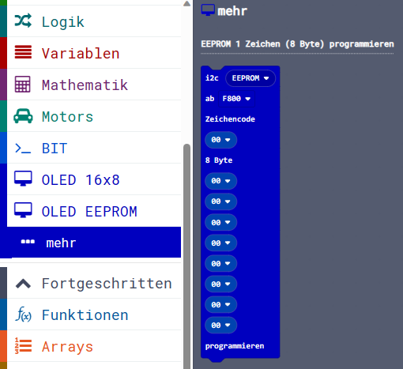

> Diese Seite bei [https://calliope-net.github.io/oled-eeprom/](https://calliope-net.github.io/oled-eeprom/) öffnen.

### Calliope Erweiterung 'EEPROM Programmierung Zeichensatz für OLED Displays':

> OLED neu gedacht - 2 Displays gleichzeitig (2x16x8=265 Zeichen) - EEPROM - 1 Stecker - i2c-Bus

> Querformat 16x8 - Hochformat 8x16 - mehrere Zeichensätze je 256 Zeichen - Bilder im EEPROM

> funktioniert mit jeder (Speicher-) Konfiguration und Version (ab 1.3) von Calliope ohne Einschränkungen

* [SparkFun Qwiic EEPROM Breakout - 512Kbit](https://www.sparkfun.com/products/18355)

* [SparkFun Qwiic OpenLog](https://www.sparkfun.com/products/15164)

Dieses Repository kann als **Erweiterung** in MakeCode hinzugefügt werden.

* öffne [makecode.calliope.cc](https://makecode.calliope.cc)
* klicke auf eine Projektvorlage
* klicke unter dem Zahnrad-Menü auf **Erweiterungen** (oder bei den Blöcken ganz unten)
* kopiere die folgende **Projekt-URL** in die Zwischenablage (Strg-C)
* **calliope-net/oled-eeprom**
* füge sie auf der Webseite oben ein (Strg-V) und klicke auf die Lupe (oder ENTER)
* wenn die Erweiterung gefunden wurde, klicke auf das Rechteck
* jetzt hat die Liste den neuen Eintrag **OLED EEPROM** bekommen

### Beschreibung der Erweiterung 'EEPROM Programmierung Zeichensatz für OLED Displays'

> Die Erweiterung **calliope-net/bit** wird automatisch mit geladen.
> Die Erweiterung **calliope-net/oled-16x8** wird zum Programmieren des EEPROM nicht gebraucht.

> Wenn der EEPROM einmal programmiert ist, kann die Erweiterung **calliope-net/oled-eeprom** entfernt werden.
> Das OLED Display benötigt nur den programmierten EEPROM am i2c-Bus und die Erweiterung **calliope-net/oled-16x8**.

Das OLED Display kann nur Pixel anzeigen. Zeichen müssen als 'Bilder' mit 8x8 Punkten dargestellt werden.
Für 1 Zeichen werden 8 Byte im Zeichengenerator belegt. Für 128 ASCII Zeichen sind das 128*8 = 1024 Byte.
Mit einem Zeichencode von 8 Bit sind aber 256 Zeichen möglich. Die Codierungen zwischen 128 und 255 werden 
z.B. für Umlaute und Sonderzeichen benutzt. Für 256 Zeichen hat der Zeichengenerator eine Größe von 2048 Byte = 2KB.

Die Datenmenge für 96 ASCCI-Zeichen lässt sich zwar im Programmcode unterbringen, aber der Platz ist bei Calliope begrenzt.
Calliope ist abgestürzt, wenn Bluetooth aktiviert war. Mit dem EEPROM wird kein Speicherplatz vom Calliope mehr 
belegt, weil die 8 Byte für jedes Zeichen direkt aus dem EEPROM gelesen werden.

So können mehrere Zeichesätze für Querformat 16 Zeilen x 8 Zeichen und Hochformat 8 Zeilen x 16 Zeichen 
an verschiedenen Adressen im EEPROM gespeichert sein. Wenn ein Zeichensatz 2KB belegt und der EEPROM 64KB
Speicherplatz hat, lassen sich auch noch Bilder unterbringen (und direkt auf das Display kopieren).

### Blöcke

#### 1. EEPROM aus String-Array im Code (Zeichencode 0x20-0x7F + Umlaute) programmieren

Dazu muss nur der EEPROM an i2c angeschlossen sein. Die letzten 2KB F800-FFFF werden mit den ASCII Zeichen beschrieben,
die im Code in String-Arrays gespeichert sind. Dabei bleiben viele Speicherbereiche frei, die später mit Sonderzeichen
belegt werden können. Die bekannten Umlaute und Sonderzeichen ÄÖÜäöü߀° werden entsprechend ihres Calliope-Zeichencodes
über die freien Stellen verteilt.

#### 2. EEPROM aus Datei auf Speicherkarte programmieren

Wie bekommt man einen großen Zeichensatz auf den EEPROM? Natürlich von der Speicherkarte!
Dazu muss der EEPROM und Qwiic OpenLog an i2c angeschlossen sein. Auf die Speicherkarte ist die (Binär-) Datei
zu kopieren. Hier ist der [Zeichensatz vom Z 9001 (2048 Byte)](BM505.BIN). Die Zeichen sind 1/4 gedreht und werden 
auf dem Display im Hochformat 8 Zeilen x 16 Zeichen richtig angezeigt. Die Zeichen-Codes 0x80-0xFF sind mit
Pseudo-Grafik Zeichen belegt.

Für die Datei werden standardmäßig die vorletzten 2KB F000-F7FF auf dem EEPROM genutzt. Die Größe der Datei wird
von Qwiic OpenLog ermittelt und darf 2048 Byte nicht überschreiten. Die tatsächliche Größe wird auf ein Vielfaches
von 128 aufgerundet und ab Anfangsadresse (F000) in den EEPROM programmiert. Eine 1KB Datei (mit 128 Zeichen)
kann auch ab F400 programmiert werden. Kürzere Dateien belegen weniger EEPROM. Die Datei wird binär kopiert.

Der Block gibt false zurück, wenn die Datei nicht auf der Speicherkarte ist oder die Datei-Größe nicht stimmt.

#### 3. EEPROM 1 Zeichen (8 Byte) programmieren

Schließlich kann ein eigenes Zeichen aus 8 Byte für einen bestimmten Zeichencode programmiert werden.
Weil es ein EEPROM ist, kann es auch wieder überschrieben werden, bis es das richtige Bild ergibt.

### Erweiterungen

> [Upates für Erweiterungen; Erweiterungen aus einem Projekt löschen.](https://calliope-net.github.io/i2c-test#updates)

> [Alle i2c-Erweiterungen für MakeCode von calliope-net (Software).](https://calliope-net.github.io/i2c-test#erweiterungen)

#### Calliope-Apps, .hex-Dateien, Bildschirmfotos mit Blöcken

> [Alle Beispiel-Projekte für MakeCode von calliope-net (Calliope-Apps).](https://calliope-net.github.io/i2c-test#programmierbeispiele)

> GitHub-Profil calliope-net: [https://github.com/calliope-net](https://github.com/calliope-net)

### Bezugsquellen

> [Alle i2c-Module und Bezugsquellen (Hardware).](https://calliope-net.github.io/i2c-test#bezugsquellen)

#### Metadaten (verwendet für Suche, Rendering)

* Calliope mini
* i2c
